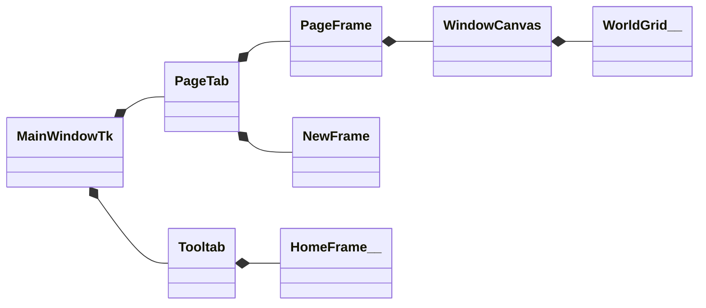
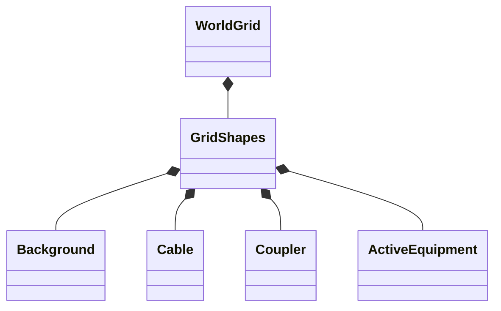

## 1.GUI
___


## 2. World Grid Class Diagram
___


## 3. HomeFrame Class Diagram
___
```mermaid
classDiagram
  HomeFrame *-- AddCable
  HomeFrame *-- AddCoupler
  HomeFrame *-- AddRiser
  HomeFrame *-- AddAmplifier

  class 
```

